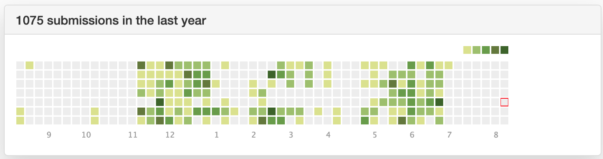
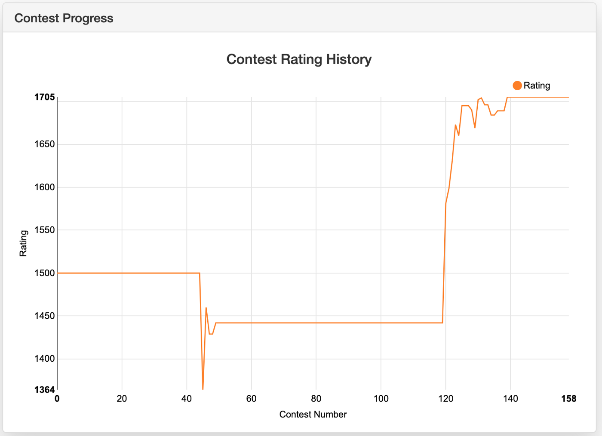

## FAANG Interview Coding Preparation
### Step 0 - Coding until you solve the questions in 45 min
- Look at the solution if you can't solve it in 30 mins.
- Weekly leetcode/topcoder contests, track progress, note the questions with link for later review.

#### How to study:
- Use timer for 45 min, solve/study
- Use a work station separate from your rest station.
- After 45 min, you must rest and treat yourself.
- Look for meaning, patterns, differences and understand the code. Use print statements.
- Do/Code it yourself.
- Think out loud. Like you are teaching it.
- Take Note. 
- Sleep is important. 

#### Solving questions Routine:
- Repeat the question in your own words
- Check assumptions and edge cases
- Use real examples
- Think out loud
- Brainstorm solutions and their time/space complexities
- Write a working code in 20-30 minutes
- Test edge cases (in your brain) line-by-line examples
- Practice makes perfect!

### Step 1: Code and System Design:
#### Coding Interview Problems: 
- https://www.lintcode.com/problem/?tag=google
- https://www.educative.io/courses/coderust-hacking-the-coding-interview
- Do not buy educative. Search the questions on leetcode.
- I was not able to do most of them so please look at the answer and upsolve. This will give you a great base to solve other similar questions.

---

1. Arrays
- Implement Binary Search on a Sorted Array
- Find Maximum in Sliding Window
- Search a Rotated Array
- Find the Smallest Common Number
- Rotate an Array by N Elements
- Find Low/High Index of a Key in a Sorted Array
- Move All Zeros to the Beginning of the Array
- Stock Buy Sell to Maximize Profit
- Merge an Array With Overlapping Intervals
- Find Pair With Given Sum in an Array
- Sort an Array Using Quicksort Algorithm

---

2. Linked List
- Implementation of Linked List
- Reverse a Singly Linked List
- Remove Duplicates from a Linked List
- Delete All Occurrences of a Given Key in a Linked List
- Sort Linked List Using Insertion Sort
- Intersection Point of Two Lists
- Find n'th Node from the End of a Linked List
- Swap Nth Node with Head
- Merge Two Sorted Linked Lists
- Sort a Linked List Using Merge Sort
- Reverse Even Nodes in a Linked List
- Rotate a Linked List
- Reverse Alternate K Nodes in a Singly Linked List
- Add Two Integers Represented by Linked Lists
- Copy Linked List with Arbitrary Pointer

---

3. Math & Stats
- Find kth Permutation
- Integer Division Without Using * or /
- Pythagorean Triplets
- All Possible Combinations for a Given Sum
- Find Missing Number
- Print All Permutations of a String
- Find All Subsets of a Set
- Is String a Valid Number?
- Calculate Power of a Number
- Calculate Square Root of a Number

---

4. Strings
- Reverse Words in a Sentence
- Remove Duplicates from a String
- Remove White Spaces from a String
- Word Break Problem
- XML to Tree
- Find all Palindrome Substrings
- Regular Expression Matching in String

---

5. Trees
- Implementation of Binary Tree
- Check if Two Binary Trees are Identical
- Write an In-Order Iterator for a Binary Tree
- Iterative In-Order Traversal of Binary Tree
- In-order Successor of Binary Search Tree
- In-order Successor Binary Search Tree With Parent Pointers
- Level Order Traversal of Binary Tree
- Is a Binary Search Tree Valid?
- Convert Binary Tree to Doubly Linked List
- Print Tree Perimeter
- Connect Same Level Siblings of a Binary Tree
- Connect All Siblings of a Binary Tree
- Serialize/Deserialize Binary Tree
- Nth Highest Number in Binary Search Tree
- Mirror Binary Tree Nodes
- Delete Zero Sum Sub-Trees
- Convert N-ary Tree to Binary Tree

---

6. Stacks and Queues
- Implement Stack Using Queues
- Implement Queue Using Stacks
- Evaluate Arithmetic Expressions

---

7. Graphs
- Clone a Directed Graph
- Minimum Spanning Tree
- Word Chaining

---

8. Back Tracking
- Boggle
- Print All Combinations of Balanced Braces
- Solve N-Queens Problem
- Find K-Sum Subsets

---

9. Dynamic Programming
- Fibonacci Numbers
- Largest Sum Subarray
- MaxSum Subsequence - Nonadjacent Elements
- Find Combinations for Game Scoring
- Coin Changing Problem
- Levenshtein Distance

---

10. Miscellaneous
- Sum of Three Values
- Make Columns and Rows Zeros
- Search in a Matrix
- Implement LRU Cache
- Determine Host Byte Order (Endianness)
- Closest Meeting Point

#### System Design: 

* https://www.youtube.com/playlist?list=PLA8lYuzFlBqAy6dkZHj5VxUAaqr4vwrka
* https://github.com/donnemartin/system-design-primer

1. System Design Problems
- System Design Interviews: A step by step guide
- Designing a URL Shortening service like TinyURL
- Designing Pastebin
- Designing Instagram
- Designing Dropbox
- Designing Facebook Messenger
- Designing Twitter
- Designing Youtube or Netflix
- Designing Typeahead Suggestion
- Designing an API Rate Limiter
- Designing Twitter Search
- Designing a Web Crawler
- Designing Facebook’s Newsfeed
- Designing Yelp or Nearby Friends
- Designing Uber backend
- Design Ticketmaster

---

2. Glossary of System Design Basics
- System Design Basics
- Key Characteristics of Distributed Systems
- Load Balancing
- Caching
- Data Partitioning
- Indexes
- Proxies
- Redundancy and Replication
- SQL vs. NoSQL
- CAP Theorem
- Consistent Hashing
- Long-Polling vs WebSockets vs Server-Sent Events

### Step 2 - Teamblind List: 
- https://www.teamblind.com/article/New-Year-Gift---Curated-List-of-Top-75-LeetCode-Questions-to-Save-Your-Time-OaM1orEU
- In leetcode list format: https://leetcode.com/list/xoqag3yj/

Array

- Two Sum - https://leetcode.com/problems/two-sum/
- Best Time to Buy and Sell Stock - https://leetcode.com/problems/best-time-to-buy-and-sell-stock/
- Contains Duplicate - https://leetcode.com/problems/contains-duplicate/
- Product of Array Except Self - https://leetcode.com/problems/product-of-array-except-self/
- Maximum Subarray - https://leetcode.com/problems/maximum-subarray/
- Maximum Product Subarray - https://leetcode.com/problems/maximum-product-subarray/
- Find Minimum in Rotated Sorted Array - https://leetcode.com/problems/find-minimum-in-rotated-sorted-array/
- Search in Rotated Sorted Array - https://leetcode.com/problems/search-in-rotated-sorted-array/
- 3Sum - https://leetcode.com/problems/3sum/
- Container With Most Water - https://leetcode.com/problems/container-with-most-water/

---

Binary

- Sum of Two Integers - https://leetcode.com/problems/sum-of-two-integers/
- Number of 1 Bits - https://leetcode.com/problems/number-of-1-bits/
- Counting Bits - https://leetcode.com/problems/counting-bits/
- Missing Number - https://leetcode.com/problems/missing-number/
- Reverse Bits - https://leetcode.com/problems/reverse-bits/

---

Dynamic Programming

- Climbing Stairs - https://leetcode.com/problems/climbing-stairs/
- Coin Change - https://leetcode.com/problems/coin-change/
- Longest Increasing Subsequence - https://leetcode.com/problems/longest-increasing-subsequence/
- Longest Common Subsequence -
- Word Break Problem - https://leetcode.com/problems/word-break/
- Combination Sum - https://leetcode.com/problems/combination-sum-iv/
- House Robber - https://leetcode.com/problems/house-robber/
- House Robber II - https://leetcode.com/problems/house-robber-ii/
- Decode Ways - https://leetcode.com/problems/decode-ways/
- Unique Paths - https://leetcode.com/problems/unique-paths/
- Jump Game - https://leetcode.com/problems/jump-game/

---

Graph

- Clone Graph - https://leetcode.com/problems/clone-graph/
- Course Schedule - https://leetcode.com/problems/course-schedule/
- Pacific Atlantic Water Flow - https://leetcode.com/problems/pacific-atlantic-water-flow/
- Number of Islands - https://leetcode.com/problems/number-of-islands/
- Longest Consecutive Sequence - https://leetcode.com/problems/longest-consecutive-sequence/
- Alien Dictionary (Leetcode Premium) - https://leetcode.com/problems/alien-dictionary/
- Graph Valid Tree (Leetcode Premium) - https://leetcode.com/problems/graph-valid-tree/
- Number of Connected Components in an Undirected Graph (Leetcode Premium) - https://leetcode.com/problems/number-of-connected-components-in-an-undirected-graph/

---

Interval

- Insert Interval - https://leetcode.com/problems/insert-interval/
- Merge Intervals - https://leetcode.com/problems/merge-intervals/
- Non-overlapping Intervals - https://leetcode.com/problems/non-overlapping-intervals/
- Meeting Rooms (Leetcode Premium) - https://leetcode.com/problems/meeting-rooms/
- Meeting Rooms II (Leetcode Premium) - https://leetcode.com/problems/meeting-rooms-ii/

---

Linked List

- Reverse a Linked List - https://leetcode.com/problems/reverse-linked-list/
- Detect Cycle in a Linked List - https://leetcode.com/problems/linked-list-cycle/
- Merge Two Sorted Lists - https://leetcode.com/problems/merge-two-sorted-lists/
- Merge K Sorted Lists - https://leetcode.com/problems/merge-k-sorted-lists/
- Remove Nth Node From End Of List - https://leetcode.com/problems/remove-nth-node-from-end-of-list/
- Reorder List - https://leetcode.com/problems/reorder-list/

---

Matrix

- Set Matrix Zeroes - https://leetcode.com/problems/set-matrix-zeroes/
- Spiral Matrix - https://leetcode.com/problems/spiral-matrix/
- Rotate Image - https://leetcode.com/problems/rotate-image/
- Word Search - https://leetcode.com/problems/word-search/

---

String

- Longest Substring Without Repeating Characters - https://leetcode.com/problems/longest-substring-without-repeating-characters/
- Longest Repeating Character Replacement - https://leetcode.com/problems/longest-repeating-character-replacement/
- Minimum Window Substring - https://leetcode.com/problems/minimum-window-substring/
- Valid Anagram - https://leetcode.com/problems/valid-anagram/
- Group Anagrams - https://leetcode.com/problems/group-anagrams/
- Valid Parentheses - https://leetcode.com/problems/valid-parentheses/
- Valid Palindrome - https://leetcode.com/problems/valid-palindrome/
- Longest Palindromic Substring - https://leetcode.com/problems/longest-palindromic-substring/
- Palindromic Substrings - https://leetcode.com/problems/palindromic-substrings/
- Encode and Decode Strings (Leetcode Premium) - https://leetcode.com/problems/encode-and-decode-strings/

---

Tree

- Maximum Depth of Binary Tree - https://leetcode.com/problems/maximum-depth-of-binary-tree/
- Same Tree - https://leetcode.com/problems/same-tree/
- Invert/Flip Binary Tree - https://leetcode.com/problems/invert-binary-tree/
- Binary Tree Maximum Path Sum - https://leetcode.com/problems/binary-tree-maximum-path-sum/
- Binary Tree Level Order Traversal - https://leetcode.com/problems/binary-tree-level-order-traversal/
- Serialize and Deserialize Binary Tree - https://leetcode.com/problems/serialize-and-deserialize-binary-tree/
- Subtree of Another Tree - https://leetcode.com/problems/subtree-of-another-tree/
- Construct Binary Tree from Preorder and Inorder Traversal - https://leetcode.com/problems/construct-binary-tree-from-preorder-and-inorder-traversal/
- Validate Binary Search Tree - https://leetcode.com/problems/validate-binary-search-tree/
- Kth Smallest Element in a BST - https://leetcode.com/problems/kth-smallest-element-in-a-bst/
- Lowest Common Ancestor of BST - https://leetcode.com/problems/lowest-common-ancestor-of-a-binary-search-tree/
- Implement Trie (Prefix Tree) - https://leetcode.com/problems/implement-trie-prefix-tree/
- Add and Search Word - https://leetcode.com/problems/add-and-search-word-data-structure-design/
- Word Search II - https://leetcode.com/problems/word-search-ii/

---

Heap

- Merge K Sorted Lists - https://leetcode.com/problems/merge-k-sorted-lists/
- Top K Frequent Elements - https://leetcode.com/problems/top-k-frequent-elements/
- Find Median from Data Stream - https://leetcode.com/problems/find-median-from-data-stream/

---

*More questions:* 
https://docs.google.com/spreadsheets/d/1KkCeOIBwUFfKrHGGZe_6EJRCIqaM6MJBo0uSIMSD9bs/edit#gid=782922309
https://seanprashad.com/leetcode-patterns/       
https://www.youtube.com/channel/UC_mYaQAE6-71rjSN6CeCA-g 

### Step 3 - A week before the interview: 
- Company specific leetcode explore questions
- Company tagged leetcode discuss
- https://www.pramp.com/ everyday

* Followed this for 3 months.
